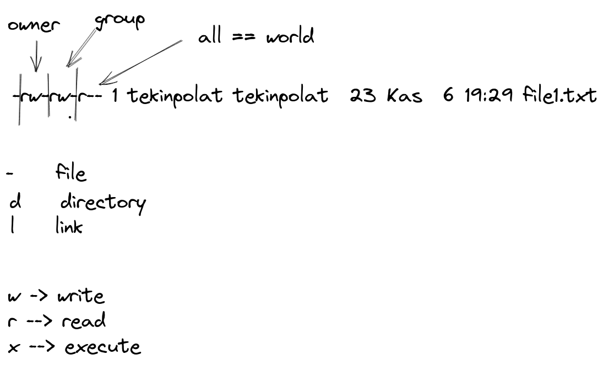

## shell programming


## 05-command

```
- who 
- whoami
- head 
- tail
- man tail, man head
```


## 04-command

``` 
wc (word count)
```

``` 
chmod FILE <-- set/change permissions to the FILE
```

``` 
##   u               g                 o                 user name      group name                  hours      file name      
##  owner(user)     group            all(other)
-   rw-              rw-               r--         1    tekinpolat      tekinpolat       23 Kas  6  19:29      file1.txt

```


``` 
command1 ; command2   --> 1.command çalışırtır sonra 2.command çalıştır
command1 && command2  --> 1.command çalışır ve 2.command çalıştır
command1 || command2  --> 1.command çalışır çalışmazsa 2.command çalıştır
```

``` 
r --> read
w --> write
x --> execute 

- file
d directory
l link 

```


``` 
cp from to
cp abc.txt def.txt

cat file.txt 
echo "tekin polat" 
~ --> tilda 
```

## 03-command 
```
man <command_line>  man wc, man ls, man more, man less, man man 
```

- \>    direction   (siler yeni veriyi koyar)

- \>>   direction   (üzerine ekle)

Redirections

```
regular expression   (regex)

Wildcard characters  (*,+, [])

* --> her şey demek   (zero or more)
```

```
ls -l ~/Desktop/[ab]*
ls -l ~/Desktop/[sb]*
       stek  ok
       bpol  ok
       atek  hata
```

``` 
ls -l ~/Desktop/*[ac]
ls -l ~/Desktop/*[acb]
    tekinc ok 
    tekind hata
    tekina ok
```

```
ls -l  /bin/*[ab]*[xy]   
       /bin/jsjamcjx    ok
       /bin/bkjky   
ls -l /bin/*[a-d]*
ls -l /bin/*[a-f]*
```

```
wc [OPTION]... [FILE]...
wc -c yigit.txt
```

```
|  pipe    (Alt GR + -)
ls -l | wc
```

```
cat 
tac
rev  --> reverse
```

*nix  -> unix veya linux

more less 

```
os 
 - windows
 - unix 
 - linux 
 - macos
```

## 02-command 
`whatis <command_man>` whatis mkdir, whatis touch

`man <command_man>` man mv, man cp, man mkdir

`touch -> timestamp output change`   touch test.txt

`cp --> copy`

`cp from to` cp test_01.txt test_02.txt

`mv --> move`

`mv from to` mv test_01.txt test_02.txt 

`rm file_name`

`rm -r directory`

`echo "test"`

- \\\     backslash
- \a     alert (BEL)
- \b     backspace
- \c     produce no further output
- \e     escape
- \f     form feed
- \n     new line
- \r     carriage return
- \t     horizontal tab
- \v     vertical tab 


## 01-command  recap
    - ls 
    - ls -l
    - ls -al

    - reset
    - clear

    - pwd    --> Print Working Directory
    - history

    - file 
    - directory

    - mkdir -->  make directory
    - mkdir directory_name
    - mkdir directory_name1 directory_name2

    - touch --> create file   
    - touch file_name
    - touch file_name1 file_name2 file_name3

    - rmdir   => remove directory
    - rmdir  file_name
    - rmdir  file_name1 file_name2

    - unlink --> file remove
    - rm  --> file remove

    - man 
    - info 
    - man pwd, man touch, man mkdir
    - info pwd, info touch, info mkdir

    - cd   --> change directory

    - cat file_name  (concatenate)
    - cat file_name_1 file_name_2

    - .. --> bir üst klasörde 
    - .  --> current directory

    - exit --> terminal exit


